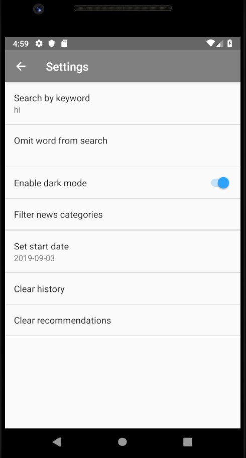
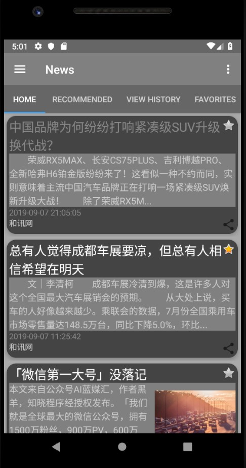
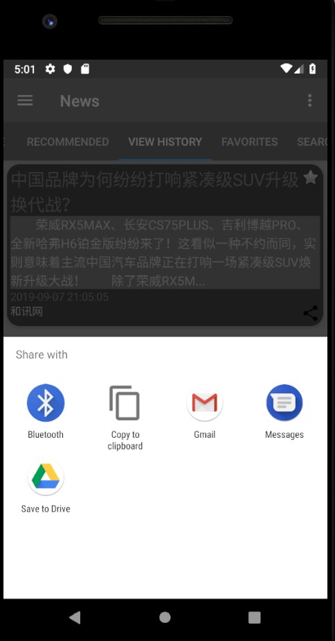
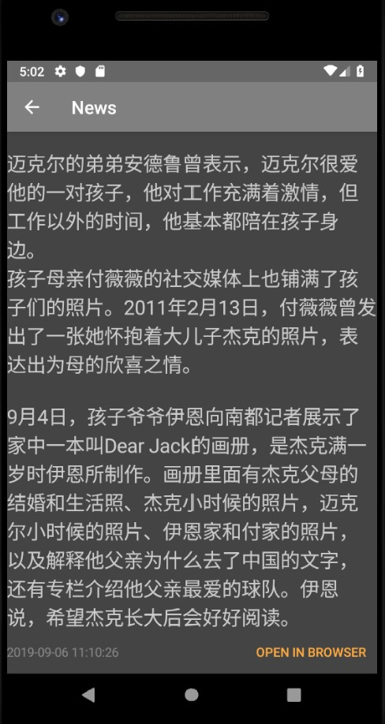

# Android News App

## Dependencies:

`Android version >= 9.0`

`target SDK version >= 28`

Note: You need to change the starting date before it will display the news

## Features

- Filter news by date, categories, and keywords
- View news in more detail and view in browser
- Get recommended news based on user's view history
- View history
- Save news to favorites for offline viewability
- Share to other app
- Dark mode

## Screenshots

